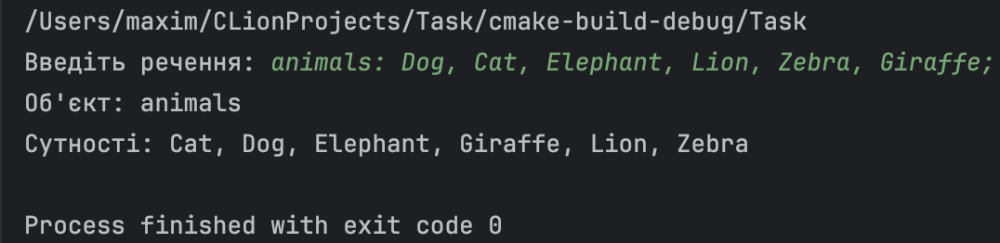
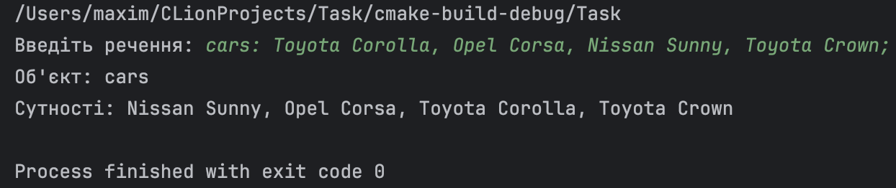

Роботу виконав студент групи ІО-14 Подлубний Максим  
## Завдання:  
На вхід програми подається речення, що містить розділені пробілами англійські слова та конструкції перерахування.  
Конструкція перерахування має такий вигляд: object: entity1, entity2, ... entityN;  
Приклад: cars: Toyota Corolla, Opel Corsa, Nissan Sunny, Toyota Crown;  
Знайти у реченні всі конструкції перерахування і відсортувати у них сутності (<entityi>) по алфавіту.  
При виконанні завдань враховувати такі вимоги та обмеження:  
1. Розмір будь-якого вхідного рядка не більше 512 символів.
2. Необхідно перевіряти, що формат вхідного рядка відповідає
формату визначеному в завданні.
3. Для роботи з рядками не можна використовувати бібліотечні
функції. Використовуються самостійно розроблені підпрограми, що оперують з рядками лише на рівні масиву символів.
4. Функція main не повинна містити жодної обробки рядків. Весь функціонал обробки тексту виноситься в підпрограми (введення, виведення, модифікація рядків).

## Результати виконання роботи:  

